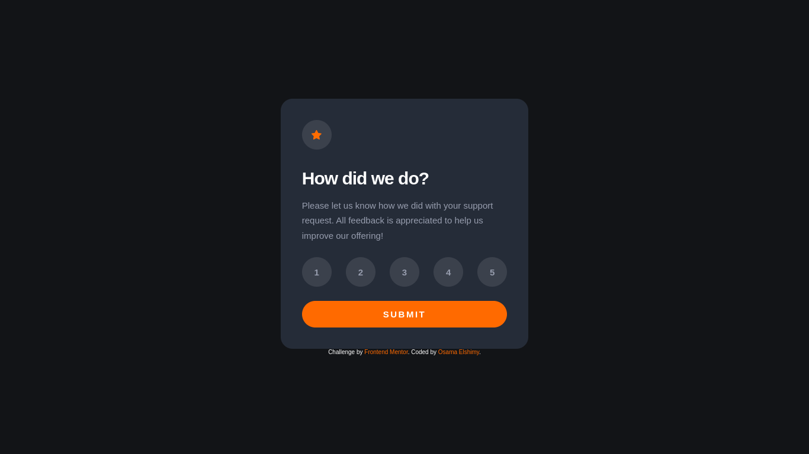

# Frontend Mentor - Interactive rating component solution

This is a solution to the [Interactive rating component challenge on Frontend Mentor](https://www.frontendmentor.io/challenges/interactive-rating-component-koxpeBUmI). Frontend Mentor challenges help you improve your coding skills by building realistic projects.

## Table of contents

- [Screenshot](#screenshot)
- [Links](#links)
- [Built with](#built-with)
- [Author](#author)

### Screenshot

### Links

- [Solution URL](https://www.frontendmentor.io/challenges/interactive-rating-component-koxpeBUmI/hub)
- [Live Site URL](https://interactive-rating-component-osama.netlify.app/)

### Built with

- Semantic HTML5 markup
- CSS custom properties
- Flexbox
- JavaScript

## Author

- GitHub - [Osama-Elshimy](https://github.com/Osama-Elshimy)
- Frontend Mentor - [Osama-Elshimy](https://www.frontendmentor.io/profile/Osama-Elshimy)
